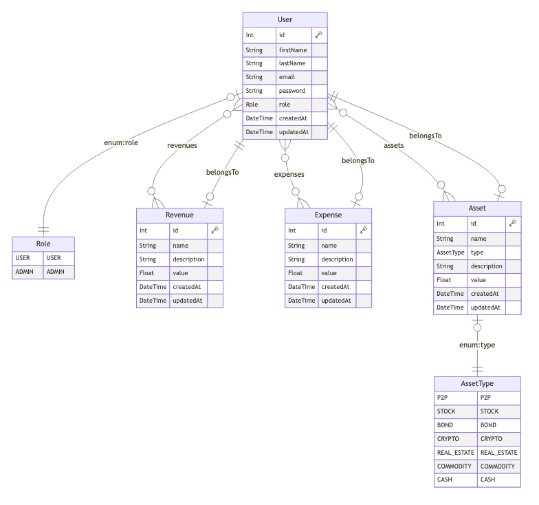

# Asset Amy

Asset Amy, ein Projekt von Robert Ackermann. Made with ♥ and ☕ in Erfurt.

## Allgemein

Hier soll eine Web-Applikation namens "Asset Amy" entstehen. Anders als die ürsprüngliche ["Asset Amy"-Software](https://github.com/batzlov/asset-amy), wird diese aber nicht mit NestJS und React als Technologie-Stack sondern ausschließlich mit .NET 7.0 implementiert.

Die Anwendung soll verschiedene Funktionen zur Verfügung stellen, darunter das Tracken von regelmäßigen Einnahmen.
Nutzerinnen und Nutzer können beispielsweise ihr monatliches Gehalt oder regelmäßige Zahlungen von Investitionen eintragen und verwalten.

Des Weiteren soll es möglich sein, regelmäßige Ausgaben zu tracken, indem Nutzerinnen und Nutzer beispielsweise Mietzahlungen, Versicherungsprämien oder monatliche Abonnements eintragen können.

Ein weiteres Feature der Anwendung soll das Tracken des persönlichen Netto-Vermögens sein. Dabei können Nutzerinnen und Nutzer ihr Vermögen in verschiedene Kategorien wie Aktien,
Immobilien oder Anleihen unterteilen und so ihre Asset Allocation darstellen.

Insgesamt soll "Asset Amy" verschiedene Funktionen zur Verwaltung von Einnahmen, Ausgaben und Vermögen bieten.

### Funktionallitäten (ursprünglich)

1. Hinzufügen, bearbeiten und löschen von Einnahmen
2. Übersicht über Einnahmen mit Hilfe verschiedener Statistiken
3. Hinzufügen, bearbeiten und löschen von Ausgaben
4. Übersicht über Ausgaben mit Hilfe verschiedener Statistiken
5. Prognose für Vermögenswachstum über verschiedene Zeiträume
6. Hinzufügen, bearbeiten und löschen von Assets
7. Übersicht über Assets mit Hilfe verschiedener Statistiken
8. (eventuell) Import der Daten aus anderen Systemen ermöglichen, interessant wäre hier bspw. der Import von Wertpapierkäufen aus einem Depot
9. Export der Daten für verschiedene Systeme ermöglichen, so z.B. Excel

### Funktionallitäten (tatsächlich)

1. Hinzufügen, bearbeiten und löschen von Einnahmen
2. Übersicht über Einnahmen mit Hilfe verschiedener Statistiken
3. Hinzufügen, bearbeiten und löschen von Ausgaben
4. Übersicht über Ausgaben mit Hilfe verschiedener Statistiken
5. Hinzufügen, bearbeiten und löschen von Assets
6. Übersicht über Assets mit Hilfe verschiedener Statistiken
7. Export der Daten für verschiedene Systeme ermöglichen, so z.B. Excel

### Projektstruktur

```
├── bin
├── Controllers
│   ├── ApiAssetController.cs
│   ├── ApiAuthController.cs
│   ├── ApiExpenseController.cs
│   ├── ApiRevenueController.cs
│   ├── AuthController.cs
│   ├── DashboardController.cs
│   └── HomeController.cs
├── DbContext
│   └── AssetAmyContext.cs
├── Managers
│   ├── AssetManager.cs
│   ├── ExpenseManager.cs
│   ├── RevenueManager.cs
│   └── UserManager.cs
├── Models
│   ├── Asset.cs
│   ├── ErrorViewModel.cs
│   ├── Expense.cs
│   ├── Revenue.cs
│   └── User.cs
├── Program.cs
├── Properties
│   └── launchSettings.json
├── README.md
├── Views
│   ├── Auth
│   │   ├── PasswordForgotten.cshtml
│   │   ├── PasswordReset.cshtml
│   │   ├── SignIn.cshtml
│   │   ├── SignUp.cshtml
│   │   └── VerifyEmail.cshtml
│   ├── Dashboard
│   │   ├── AssetAllocation.cshtml
│   │   ├── Expenses.cshtml
│   │   ├── Index.cshtml
│   │   └── Revenues.cshtml
│   ├── Home
│   │   ├── Error404.cshtml
│   │   ├── Index.cshtml
│   │   └── Privacy.cshtml
│   ├── Shared
│   │   ├── Error.cshtml
│   │   ├── Icons
│   │   │   ├── BankNotes.cshtml
│   │   │   ├── ChartPie.cshtml
│   │   │   ├── CreditCard.cshtml
│   │   │   └── Home.cshtml
│   │   └── Layouts
│   │       ├── _AuthLayout.cshtml
│   │       ├── _DashboardLayout.cshtml
│   │       ├── _ErrorLayout.cshtml
│   │       ├── _LandingLayout.cshtml
│   │       └── _Layout.cshtml
│   └── _ViewImports.cshtml
├── appsettings.Development.json
├── appsettings.json
├── asset-amy.csproj
├── asset-amy.sln
├── bin
├── docs
│   └── database
│       └── db-erd.png
├── global.json
├── obj
├── prisma
│   ├── node_modules
│   ├── package-lock.json
│   ├── package.json
│   └── prisma
│       ├── migrations
│       ├── schema.prisma
│       └── seed.ts
└── wwwroot
    ├── assets
    │   └── ...
    ├── css
    │   └── app.css
    ├── js
    │   ├── app.js
    │   ├── auth
    │   │   ├── password-forgotten.js
    │   │   ├── password-reset.js
    │   │   ├── sign-in.js
    │   │   └── sign-up.js
    │   ├── dashboard
    │   │   ├── Index.js
    │   │   ├── assets.js
    │   │   ├── expenses.js
    │   │   └── revenues.js
    │   └── shared
    │       ├── constants.js
    │       ├── form.js
    │       ├── modal.js
    │       ├── request.js
    │       ├── schema.js
    │       ├── toast.js
    │       └── utils.js
    ├── lib
    │   ├── chartjs
    │   ├── daisyui
    │   └── tailwind
    └── mails
        ├── reset-password.html
        └── verify-email.html
```

### ERD-Modell



### Integration von Prisma in das Projekt

Anlegen des Projekts und installieren von Paketabhängigkeiten. Das bearbeiten der "prisma.schema"-Datei wird hier nicht genauer beschrieben.

```
    mkdir prisma
    cd prisma
    npm init -y
    npm i --save-dev prisma
    npx prisma init
    npx prisma migrate dev --name init
```

Installieren der Paketabhängigkeiten für .net. Als Connector wird MySql genutzt.

```
    cd ..
    dotnet add package Pomelo.EntityFrameworkCore.MySql
    dotnet add package Microsoft.EntityFrameworkCore.Tools
    dotnet add package Microsoft.EntityFrameworkCore.Design
```

Erstellen des DbContext und der Model-Dateien. Parameter müss hier je nach Datenbank-Konfiguration abgeändert werden.

```
    dotnet ef dbcontext scaffold "Server=<host>;Port=<port>;Database=<db-name>;User Id=<db-user>;Password=<db-user-password>"
    Pomelo.EntityFrameworkCore.MySql --context-dir DbContext
    --context AssetAmyContext --output-dir Models
```

```
    dotnet ef dbcontext scaffold "Server=localhost;Port=8889;Database=asset-amy-dotnet;User Id=root;Password=root"
    Pomelo.EntityFrameworkCore.MySql --context-dir DbContext
    --context AssetAmyContext --output-dir Models
```

Erstellen der Models unter Ausschluss der Migration-Tabelle

```
    dotnet ef dbcontext scaffold "Server=localhost;Port=8889;Database=asset-amy-dotnet;User Id=root;Password=root"
    Pomelo.EntityFrameworkCore.MySql --context-dir DbContext --context AssetAmyContext
    --output-dir Models --force --table User --table Asset --table Expense --table Revenue
```
